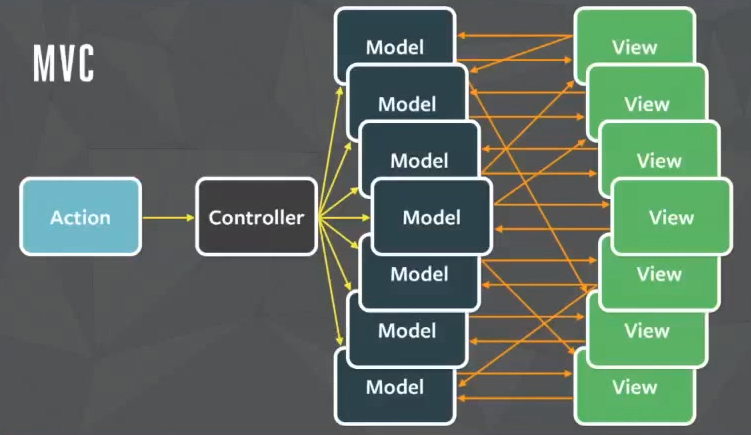
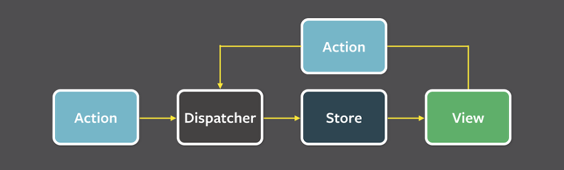

## Flux

### 참고자료

- [Flux | 사용자 인터페이스를 만들기 위한 어플리케이션 아키텍쳐](https://haruair.github.io/flux/docs/overview.html)
- [Flux와 Redux에 대한 이해](https://baeharam.netlify.app/posts/architecture/flux-redux)
- [Flux, MVC 비교](https://beomy.tistory.com/44)

 

### Flux란?

물리학적 정의에 따르면 Flux는 다른 물질의 반응을 촉진시켜 주는 촉매와 같은 역할을 하는 어떤 것을 의미한다. 
이 개념을 컴퓨터 공학적으로 접근해본다면 Flux는 일종의 흐름으로 볼 수 있으며 다른 대상의 요청에 의해 반응할 수 있는 것이다. Flux는 단방향 데이터 흐름을 활용해 뷰 컴포넌트를 구성하는 React를 보완하는 역할을 한다. 

 

기존 MVC는 양방향 데이터흐름이기 때문에 기능을 추가할수록 아키텍처의 복잡도가 기하급수적으로 증가했다. Controller는 Model의 데이터를 조회하거나 업데이트하는 역할을 한다. Model이 업데이트 되면, View는 화면에 반영합니다. View가 Model을 업데이트 할 수도 있다. Model이 업데이트 되어 View가 따라서 업데이트 되고, 업데이트 된 View가 다시 다른 Model을 업데이트 한다면, 또 다른 View가 업데이트 될 수 있다.  MVC의 데이터 흐름이 굉장히 복잡하다는 것을 알 수 있다.

 

페이스북(현 메타)에서는 양방향 데이터 흐름 때문에 복잡도가 높아졌기 때문에 이를 해결하기 위해 `Flux`라는 단방향 데이터 흐름으로 만들어낸 아키텍쳐를 사용하기 시작했다. 요청과 상태 변화가 촉매제가 되어 모든 컴포넌트에 영향을 미칠 수 있고 그 변화가 예측 가능해졌다.

 

### Redux